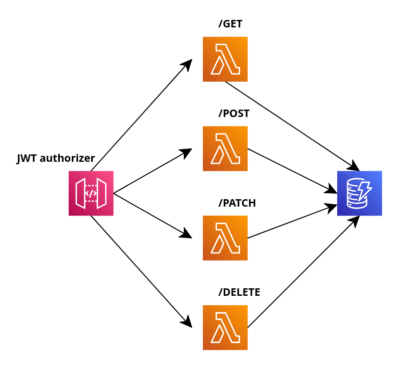

# 📝 Notes Management API

This project is a serverless REST API designed to manage **user notes**, allowing authenticated users to create, read, update, and delete their own notes.

The API is implemented using **NestJS** and runs on AWS using **API Gateway, AWS Lambda, and DynamoDB**, with all infrastructure defined as code via the **Serverless Framework**.

The main goal of this project is to demonstrate clean architecture, proper separation of concerns, and best practices when building scalable serverless applications on AWS.

---

## 🏗️ Architecture Overview

The following diagram illustrates the high-level architecture of the system.

API Gateway exposes REST endpoints and handles authentication using a **built-in JWT Authorizer**, ensuring that only valid requests reach the backend. Each HTTP method is routed to a dedicated Lambda function responsible for the corresponding CRUD operation. The Lambda functions encapsulate the business logic and interact with DynamoDB as the persistence layer.

This design avoids direct service proxy integrations between API Gateway and DynamoDB, keeping the application logic isolated, testable, and easier to maintain.

